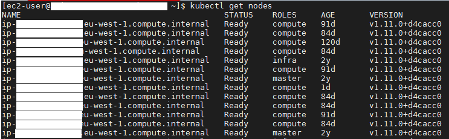
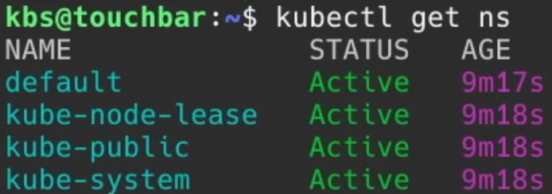
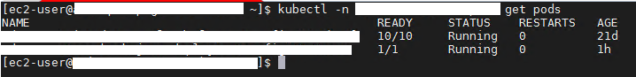
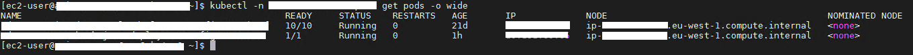

# Kubernetes

## Términos que hay que conocer cuando se habla de Kubernetes:
- **Node:** Un nodo es una máquina de trabajo en Kubernetes. Un nodo puede ser una máquina virtual o física, dependiendo del tipo de clúster.

- **Cluster:** Un clúster de Kubernetes es un conjunto de máquinas de nodos que ejecutan aplicaciones en contenedores. Si ejecuta Kubernetes, está ejecutando un clúster.

- **Namespace:** Es una división lógica de un cluster de kubernetes, separar la carga en el cluster.

- **Pod:** Un pod es un set de contenedores. Puede estar basado en 1 o más contenedores, lo recomendado es que estos corran unicamente 1.

### Listar los nodos (máquinas)
`kubectl get nodes`

### Listar los namespaces
`kubectl get ns`

Existen esos 4 namespaces por defecto.

### Listar los pods
Para listar los pods de un proyecto hay que indicar el nombre del proyecto, esto se hace con el parámetro *-n*.
`kubectl -n <project_name> get pods`

#### Obtener más información de los pods:

