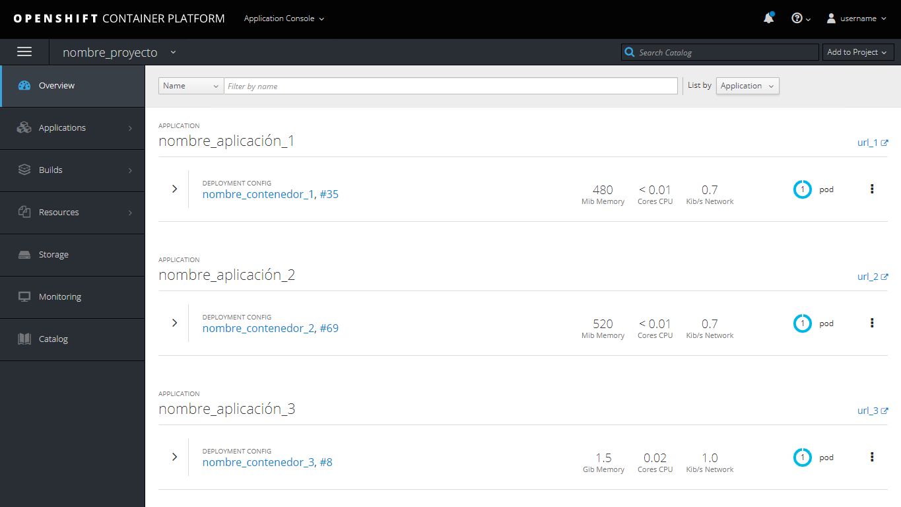

# [Openshift](https://www.redhat.com/es/technologies/cloud-computing/openshift)

## Términos que hay que conocer cuando se habla de Openshift / contenedores:
- **Pod:** Un Pod es un contenedor, tenemos x aplicación y que dentro tiene dos pods, uno que maneja la aplicación y otro que maneja el guardado de datos (mongoDB), por ejemplo.

### Login en la consola de OCP terminal:
`oc login -u <user>`

### Listado de pods de un proyecto que quieres:
`oc get pods -n <nombre_proyecto>`

### Listado de proyectos:
`oc get projects`

